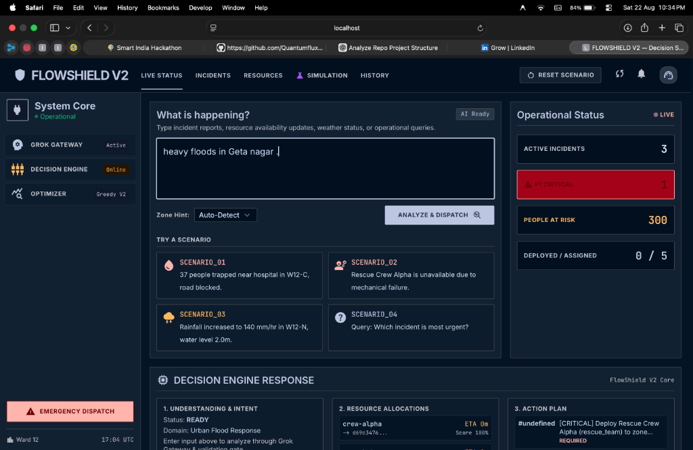
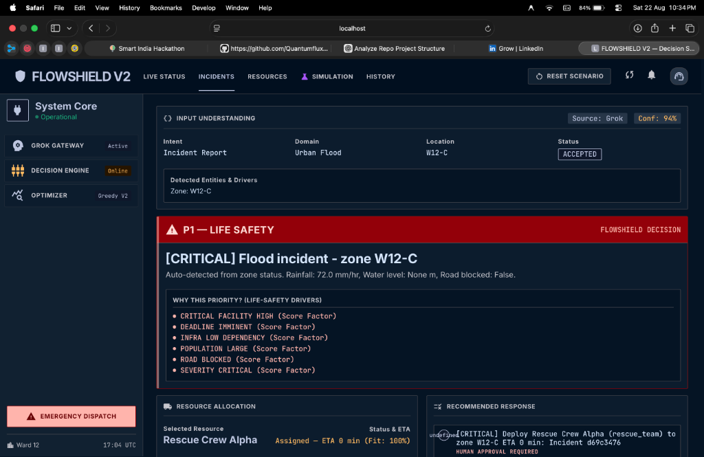
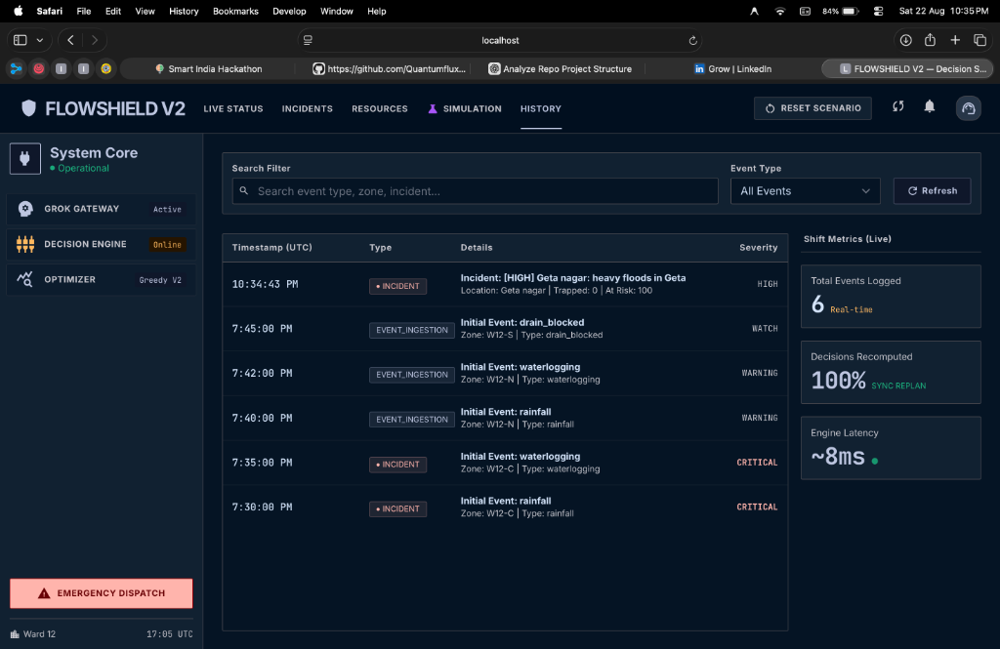
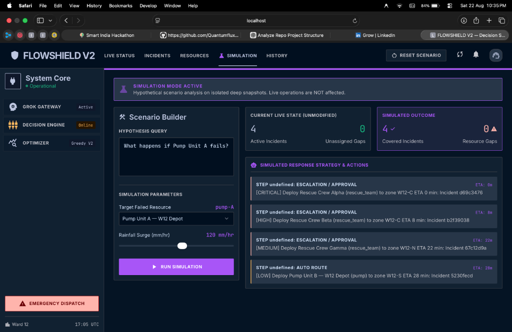

# FLOWSHIELD

### Flood Emergency Coordination & Decision Support

FLOWSHIELD helps emergency authorities respond to rapidly changing flood situations by turning fragmented information into prioritized, resource-aware response decisions.

It helps identify who is at risk, determine what requires attention first, allocate available resources, and replan when conditions change.


---

## From Information to Action

```
Flood Information
        ↓
    Understand
        ↓
Prioritize Life Safety
        ↓
 Allocate Resources
        ↓
Coordinate Response
        ↓
Replan When Conditions Change
```

FLOWSHIELD is not just a flood dashboard. It is an end-to-end decision-support and coordination system that turns raw, unstructured emergency signals into actionable, life-safety-first response operations.

---

## End-to-End Operational Workflow

### Step 1: Real-Time Situation Awareness & Command Dashboard
The main command center monitors multi-zone flood telemetry, active incidents, citizens at risk, and deployed response units in real time.


---

### Step 2: Flexible Natural-Language Incident Reporting
Operators and dispatchers input unformatted field reports (*"heavy floods in Geta nagar"*) directly into the natural-language command gateway without needing to navigate complex manual forms.



---

### Step 3: AI Input Understanding & Explainable Life-Safety Decisions
The intelligent gateway validates and classifies incoming reports (94% confidence via Grok LLM / offline deterministic parser). The mathematical engine computes a **P1 Life-Safety** score with transparent driver explanations, selects optimal response assets (e.g. *Rescue Crew Alpha*), and generates policy-grounded SOP actions.



---

### Step 4: Real-Time Audit Trail & Operational Metrics
Every incident ingestion, priority recomputation, and resource allocation is persisted in an immutable, searchable history timeline with **100% synchronous replanning** and **~8ms decision latency**.



---

### Step 5: Isolated What-If Simulation Studio
Emergency coordinators test hypothetical disaster scenarios (*"What happens if Pump Unit A fails during a 120 mm/hr rainfall surge?"*) on isolated deep snapshots to evaluate resource gaps and test escalation strategies before committing live units.



---

## Key Capabilities

### 🚨 Life-Safety Prioritization
Identifies incidents where citizens are trapped or critical facilities are endangered, elevating them to top operational priority with transparent driver explanations.

### 🚜 Resource Allocation
Matches high-urgency incidents with available, capability-aligned response assets (rescue teams, high-capacity dewatering pumps, heavy vehicles) while accounting for travel time.

### 🔄 Dynamic Replanning
Automatically recalculates resource assignments and operational plans the moment an asset breaks down, road access changes, or a new critical incident emerges.

### 💬 Flexible Emergency Input
Allows operators and dispatchers to enter reports naturally (*"37 people trapped near civil hospital in W12-C"*) without requiring rigid form fields.

### 🔍 Explainable Response
Provides explicit audit trails for every decision—showing exactly why an incident was prioritized and why a specific resource was selected over alternatives.

---

## Architecture

```
Input
  ↓
Input Understanding
  ↓
Validation
  ↓
Situation State
  ↓
Life-Safety Priority
  ↓
Resource Allocation
  ↓
Response
  ↓
Replan
```

An LLM-based input gateway converts flexible natural-language emergency reports into structured requests before they enter the validated FLOWSHIELD decision pipeline. The current implementation uses the Grok API for this layer with a full offline deterministic fallback.

FLOWSHIELD separates input interpretation from the operational decision engine so future models, data sources, and optimization methods can be introduced without replacing the core.

📖 *Detailed technical documentation:* [docs/V2_ARCHITECTURE.md](docs/V2_ARCHITECTURE.md) | [docs/V2_API_CONTRACT.md](docs/V2_API_CONTRACT.md)

---

## Technology Stack

| Layer | Technology |
|---|---|
| **Frontend** | HTML5, Tailwind CSS, Material Symbols, Vanilla JavaScript |
| **Backend** | Python 3.11+, stdlib `ThreadingHTTPServer` (Zero external framework bloat) |
| **Data Contracts** | Pydantic v2 (Strict validation mode, `extra="forbid"`) |
| **Input Intelligence** | Grok / Groq API (`openai/gpt-oss-120b`) + Rule-Based NLP Fallback |
| **Reasoning Layer** | IBM Granite (`ibm/granite-3-8b-instruct`) + Policy Grounding |
| **Knowledge Engine** | BM25 Inverted Keyword Index (SOP / Policy Corpus) |
| **Quality & Tests** | pytest (619 tests passing), ruff |

---

## Quick Start

```bash
# 1. Clone repository
git clone https://github.com/Quantumflux07/flood_ai_final_version.git
cd flood_ai_final_version

# 2. Install dependencies
pip install -e ".[dev]"

# 3. Run test suite
pytest

# 4. Start the command dashboard
python scripts/serve_dashboard.py
```

Open **`http://localhost:8000/`** in your browser to access the FLOWSHIELD V2 Command Center.
