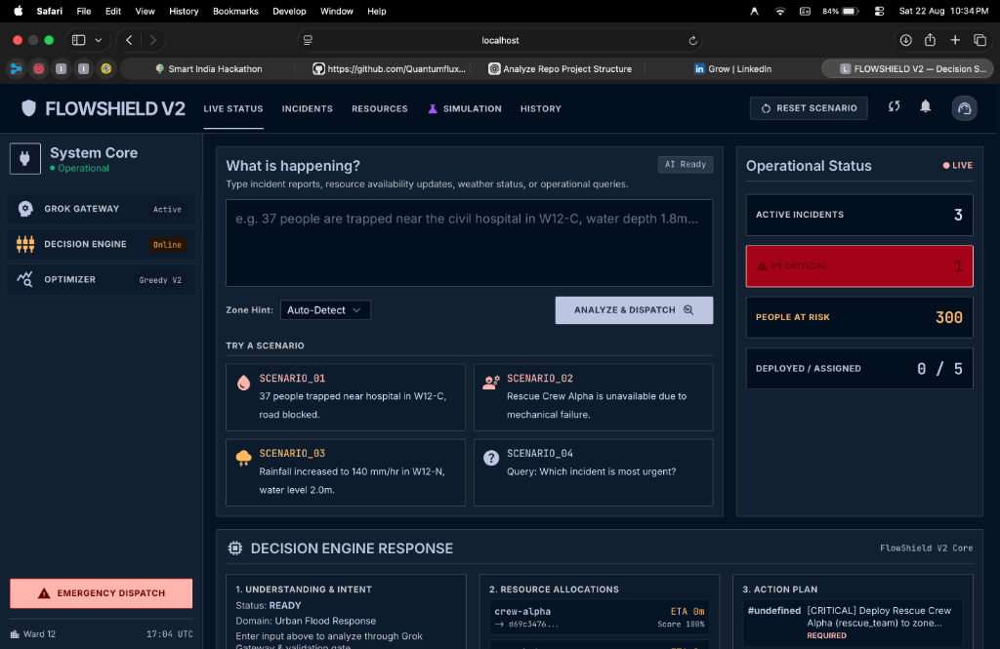

# FLOWSHIELD

### Flood Emergency Coordination & Decision Support

FLOWSHIELD helps emergency authorities respond to rapidly changing flood situations by turning fragmented information into prioritized, resource-aware response decisions.

It helps identify who is at risk, determine what requires attention first, allocate available resources, and replan when conditions change.



---

## From Information to Action

```
Flood Information
        ↓
    Understand
        ↓
Prioritize Life Safety
        ↓
 Allocate Resources
        ↓
Coordinate Response
        ↓
Replan When Conditions Change
```

FLOWSHIELD is not just a flood dashboard. It is a decision-support and coordination system that turns raw, incomplete flood signals into actionable, life-safety-first emergency operations.

---

## Key V2 Capabilities

### 🚨 Life-Safety Prioritization
Identifies incidents where citizens are trapped or critical facilities are endangered, elevating them to top operational priority with transparent driver explanations.

### 🚜 Resource Allocation
Matches high-urgency incidents with available, capability-aligned response assets (rescue teams, high-capacity dewatering pumps, heavy vehicles) while accounting for travel time.

### 🔄 Dynamic Replanning
Automatically recalculates resource assignments and operational plans the moment an asset breaks down, road access changes, or a new critical incident emerges.

### 💬 Flexible Emergency Input
Allows operators and dispatchers to enter reports naturally (*"37 people trapped near civil hospital in W12-C"*) without requiring rigid form fields.

### 🔍 Explainable Response
Provides explicit audit trails for every decision—showing exactly why an incident was prioritized and why a specific resource was selected over alternatives.

---

## Example

```
"37 people are trapped near a hospital and the road is flooded."
        ↓
P1 — LIFE SAFETY (Score: 0.98 | Critical Facility & People Trapped)
        ↓
Rescue Crew 03 selected (ETA: 8 mins)
        ↓
Response plan generated (Approval Required)
        ↓
"Crew 03 is unavailable due to mechanical failure"
        ↓
FLOWSHIELD replans instantly
        ↓
Rescue Crew 02 reallocated & dispatch updated
```

*The system dynamically adapts in real time as field conditions and asset availability change.*

---

## Architecture

```
Input
  ↓
Input Understanding
  ↓
Validation
  ↓
Situation State
  ↓
Life-Safety Priority
  ↓
Resource Allocation
  ↓
Response
  ↓
Replan
```

An LLM-based input gateway converts flexible natural-language emergency reports into structured requests before they enter the validated FLOWSHIELD decision pipeline. The current implementation uses the Grok API for this layer with a full offline deterministic fallback.

FLOWSHIELD separates input interpretation from the operational decision engine so future models, data sources, and optimization methods can be introduced without replacing the core.

📖 *Detailed technical documentation:* [docs/V2_ARCHITECTURE.md](docs/V2_ARCHITECTURE.md) | [docs/V2_API_CONTRACT.md](docs/V2_API_CONTRACT.md)

---

## Technology Stack

| Layer | Technology |
|---|---|
| **Frontend** | HTML5, Tailwind CSS, Material Symbols, Vanilla JavaScript |
| **Backend** | Python 3.11+, stdlib `ThreadingHTTPServer` (Zero external framework bloat) |
| **Data Contracts** | Pydantic v2 (Strict validation mode, `extra="forbid"`) |
| **Input Intelligence** | Grok / Groq API (`openai/gpt-oss-120b`) + Rule-Based NLP Fallback |
| **Reasoning Layer** | IBM Granite (`ibm/granite-3-8b-instruct`) + Policy Grounding |
| **Knowledge Engine** | BM25 Inverted Keyword Index (SOP / Policy Corpus) |
| **Quality & Tests** | pytest (619 tests passing), ruff |

---

## Quick Start

```bash
# 1. Clone repository
git clone https://github.com/Quantumflux07/flood_ai_final_version.git
cd flood_ai_final_version

# 2. Install dependencies
pip install -e ".[dev]"

# 3. Run test suite
pytest

# 4. Start the command dashboard
python scripts/serve_dashboard.py
```

Open **`http://localhost:8000/`** in your browser to access the FLOWSHIELD V2 Command Center.